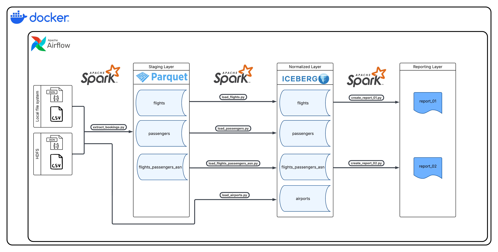
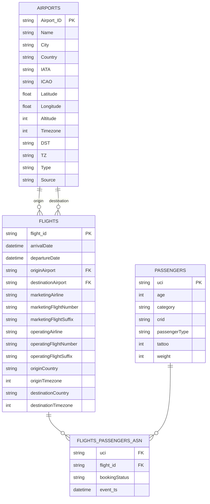
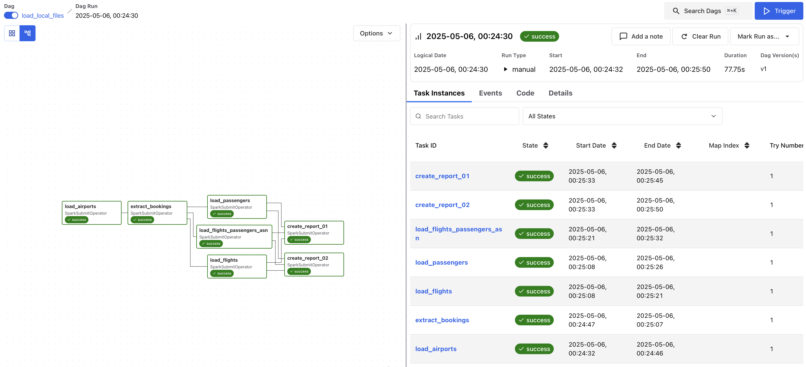

# Architecture, design choices
I created the diagram below to demonstrate the different components of the data pipeline.

## Data Processing
- Apache Spark is able to process hundreds of TBs of data, as described in the requirements.
- It is compatible with many different file formats. 
- Can process files both from local filesystem and also from HDFS.
- It is runnable on a notebook or can be deployed to a cluster with horizontal scaling opportunity.
- Supports streaming, which can be useful for possible future features.

## Orchestration Tool
- Apache Airflow provides a UI for managing and monitoring DAGs, which fulfills the requirement of having an easy-to-run application for the users.
- Native support for Spark jobs.
- Supports scheduled and event-driven / manual executions.

## Data Formats

### Parquet (for staging)
- Columnar data format, ideal for read heavy analytical workloads.
- Works best with large files, therefore ideal for batch jobs.
- With every execution the staging layer is overwritten, therefore updates and deletes are not applied.

### Apache Iceberg (for normalized)
- Provides ACID transactions.
- Supports schema evolution which can be useful for possible future changes.
- Supports time travel and rollbacks.
- Works well both on distributed file systems and cloud storage systems, which can be useful in case of a future cloud migration.

# Layers
## Staging Layer
- The flights, passengers, and booking information (assignment of the passengers to the flights) are extracted from the source (JSON) files within `extract_bookings.py` Spark job. 
- The result is stored in Parquet files, in different folder for each entity. 
- The staging layer only contains the data from the files ingested with the latest execution and is always overwritten in case of a new execution of the pipeline.

## Normalized Layer
- The normalized layer contains the following tables:
    - airports
    - flights
    - passengers
    - flights_passengers_asn
- The data is stored in Apache Iceberg tables.
- Data from all previously loaded files are persisted in this layer.
    - MERGE on Iceberg tables: when matched then UPDATE, when not matched then INSERT

## Reporting Layer
- Currently contains the following reports:
    - pasengers_by_country_dayofweek_season
        - number of passengers per country, per day of the week, per season ordered by number of passengers descending
    - demograhpy_by_destination_country
        - number of passengers per country, number of adults vs. children, average age of passengers
- Because of the current requirements there can only be a limited number of rows in the reports, therefore it is stored as CSV file.

# Data Model
## ER Diagram

## Design choices
- I kept most of the source fields as it is. The reason is that for future use cases we might need more fields than what we use currently.
- The flights entity did not contain an identifier by definition. I assumed that the arrivalDate, departureDate, originAirport, destinationAirport and the operatingAirline uniquely identify a flight, therefore I used the MD5 hash of the combination of these columns.
    - `df_flights.withColumn("flight_id", F.md5(F.concat_ws("|", "arrivalDate", "departureDate", "originAirport", "destinationAirport", "operatingAirline")))`
- The flights entity has been extended with originCountry, originTimezone, destinationCountry, destinationTimezone columns in order to simplify the creation of reports.
- Considering the data volume of the real dataset, the flights_passengers_asn Iceberg table might perform better with partitions.
    - I created the Iceberg table partitioned by days, based on the timestamp of the booking. This might has to be fine-tuned based on the distribution of the real data.
    - `.partitionedBy(F.days("event_ts"))`

# DAGs

## load_local_files
- Processes the source files from the local file system and writes the results to the local file system.
## load_hadoop_files
- Processes the source files from the given HDFS URI and also writes the results to HDFS.

# Open Questions
- Some part of the requirements were not obvious. In these cases I did what I assumed to be the best, therefore I created this section in the documentation to clarify it.
## start_date and end_date
- The user can enter these values and it will only create the report based on the bookings where the event_ts is in range.
- The complete dataset is loaded to the normalized layer, the filter only applies for the report itself.

## Local timezone of airport
> The day of the week should be based on the local timezone for the airport.
- It was not clear which airport should be taken into consideration, so currently it's adjusting the departure time based on the local timezone of the departure airport. (can be easily changed if needed)

## Time to consider for the report
> The output should be a table where each row shows the number of passengers per country, per day of the week, per season.
- There are multiple dates to take into consideration:
    - arrival / departure time of a flight
    - timestamp of the booking event
- By choosing the event_ts, we get insights on which day for which countries have the users booked tickets.
- **By choosing the arrival / departure times, we get insights on which day which countries are most popular for travel.**
- I decided to go with the 2nd option, because:
    - Based on the description, the application should help KLM adding new flight routes. For that purpose the second option seems to be better.
    - The sample dataset only contains one distinct event_ts.

---

# How to run the application

## 1. Configuration
- In `airflow/config/config.json` the path to the source files can be changed, as well as the `start_date` and `end_date` parameters can be applied.
- It is already pre-configured, it's not necessary to change it.

## 2. Starting the containers
- Open the terminal in the project's folder and run: `docker-compose up --build -d`

## 3. Initializing HDFS
- We can run the application with files in a local folder or on HDFS.
- Before running it on HDFS, please execute the following on the terminal: `bash utils/initialize_hdfs.sh`
- This will upload the sample files to HDFS and adjust the needed permissions.

## 4. Starting the application
- You can find the password for the `admin` user of Airflow in the following file of the Airflow container: `/opt/airflow/simple_auth_manager_passwords.json.generated`. You can access the file system with Docker Desktop.
- You can log in to Airflow on the following URL: `http://localhost:8081`
- You can find the DAGs here: `http://localhost:8081/dags`
- You can select the DAG and click `Trigger` to start it.

## 5. Checking the results
### 5.1. DAG: load_local_files
- After the DAG was executed successfully, you will see the created files in the `warehouse/` folder.

### 5.2. DAG: load_hadoop_files
- After the DAG was executed successfully, you can access HDFS on this URL: `http://localhost:9870/explorer.html#/`
