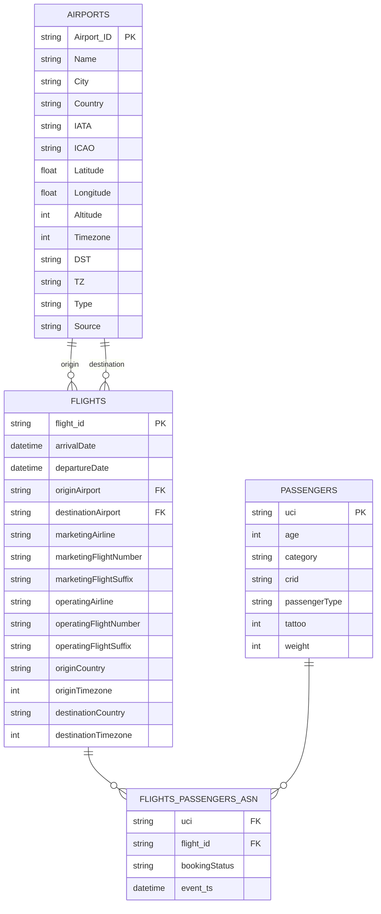

# Architecture, design choices
I created the diagram below to demonstrate the different components of the data pipeline.

## Data Processing
- Apache Spark is able to process hundreds of TBs of data, as described in the requirements.
- It is compatible with many different file formats. 
- Can process files both from local filesystem and also from HDFS.
- It is runnable on a notebook or can be deployed to a cluster with horizontal scaling opportunity.
- Supports streaming, which can be useful for possible future features.

## Orchestration Tool
- Apache Airflow provides a UI for managing and monitoring DAGs, which fulfills the requirement of having an easy-to-run application for the users.
- Native support for Spark jobs.
- Supports scheduled and event-driven / manual executions.

## Data Formats

### Parquet (for staging)
- Columnar data format, ideal for read heavy analytical workloads.
- Works best with large files, therefore ideal for batch jobs.
- With every execution the staging layer is overwritten, therefore updates and deletes are not applied.

### Apache Iceberg (for normalized)
- Provides ACID transactions.
- Supports schema evolution which can be useful for possible future changes.
- Supports time travel and rollbacks.
- Works well both on distributed file systems and cloud storage systems, which can be useful in case of a future cloud migration.

# Layers
## Staging Layer
- The flights, passengers, and booking information (assignment of the passengers to the flights) are extracted from the source (JSON) files within `extract_bookings.py` Spark job. 
- The result is stored in Parquet files, in different folder for each entity. 
- The staging layer only contains the data from the files ingested with the latest execution and is always overwritten in case of a new execution of the pipeline.

## Normalized Layer
- The normalized layer contains the following tables:
    - airports
    - flights
    - passengers
    - flights_passengers_asn
- The data is stored in Apache Iceberg tables.
- Data from all previously loaded files are persisted in this layer.
    - MERGE on Iceberg tables: when matched then UPDATE, when not matched then INSERT

## Reporting Layer
- Currently contains the following reports:
    - pasengers_by_country_dayofweek_season
        - number of passengers per country, per day of the week, per season ordered by number of passengers descending
    - demograhpy_by_destination_country
        - number of passengers per country, number of adults vs. children, average age of passengers
- Because of the current requirements there can only be a limited number of rows in the reports, therefore it is stored as CSV file.

# Data Model

